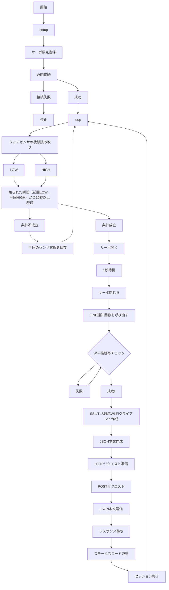

# automatic-cat-treat-dispenser

# 概要
タッチセンサに触れたら、サーボモーターでゲートを開閉し、自動でおやつを排出してLINEで排出したことを通知する

# 機能
・タッチセンサで触れたらおやつを排出する

・タッチセンサの出力がHIGHになればサーボモーターでゲートを開閉する

・おやつが排出されたら、LINEで時刻とメッセージを通知させる

※余裕があれば機能を追加する

# 使用モジュール
|部品|個数|用途|接続ピン|
|:---:|:---:|:---:|:---:|
|Arduino UNO R4 WiFi|1|通信・制御|USBケーブル|
|タッチセンサ（TTP223B）|1|手動給餌トリガー|D2|
|サーボモータ(9G Servo)|1|- フラップゲートの開閉制御|D9|

# 使用ライブラリ（ソフトウェア）
・WiFiS3.h

　→Arduino UNO R4 WiFi向けのWi-Fi制御ライブラリ

・ArduinoHttpClient.h

　→‣HTTP/HTTPSリクエストを簡単に送るためのライブラリ
 
・Servo.h

 　→Arduino標準ライブラリのひとつで、サーボモータを簡単に制御するためのヘッダファイル
  
・arduino_secrets.h

　→WiFi接続

# 配線図
  

# 回路図

# 動作仕様書

